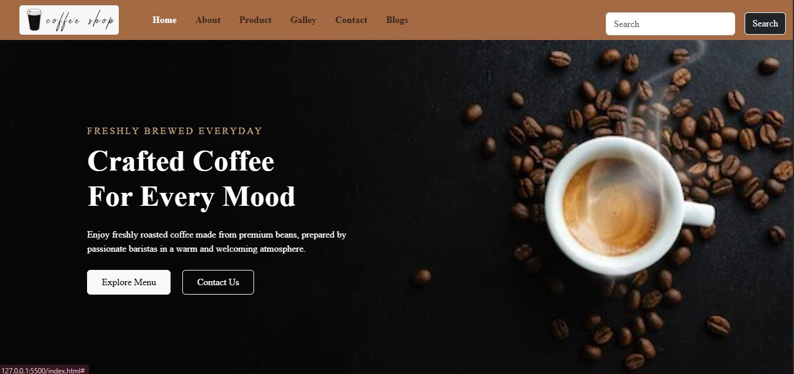
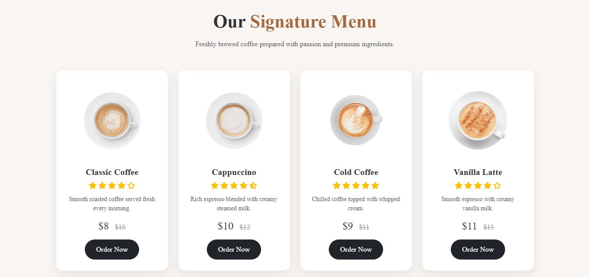
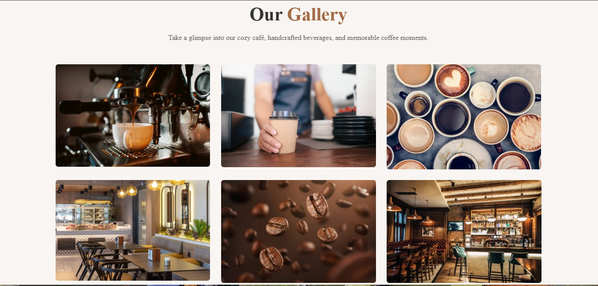

# ☕ Coffee House Website

A modern and responsive Coffee House landing page built using **HTML5, CSS3, and Bootstrap 5**. The website features a clean user interface, responsive layout, smooth animations, and an attractive design suitable for showcasing a coffee shop or café.

---

## 📸 Preview


Example:

- Home Page

- Menu Section

- Gallery

---

## 🚀 Live Demo

🔗 https://landertalk01-bot.github.io/coffee/

---

## ✨ Features

- Modern and responsive design
- Fully responsive navigation bar
- Attractive hero banner
- About Us section
- Coffee Categories
- Signature Menu
- Product showcase
- Image Gallery
- Contact section
- Blog section
- Professional footer
- Font Awesome Icons
- AOS Scroll Animations
- Bootstrap 5 Components

---

## 🛠 Technologies Used

- HTML5
- CSS3
- Bootstrap 5
- JavaScript
- AOS (Animate On Scroll)
- Google Fonts
- Font Awesome

---

## 📂 Folder Structure

```
coffee/
│
├── index.html
├── style.css
│
├── img/
│   ├── banner.jpg
│   ├── logo.jpg
|   ├── menu.png
|   ├── home.png
|   ├── gallery.png
│   └── images/
│       ├── about.png
│       ├── c1.png
│       ├── c2.png
│       ├── c3.png
│       ├── m1.png
│       ├── m2.png
│       ├── ...
│
└── README.md
```

---

## 📱 Responsive Design

The website has been optimized for different screen sizes:

- Desktop
- Laptop
- Tablet
- Mobile Devices

---

## 🎯 Learning Objectives

This project was created to improve my skills in:

- Responsive Web Design
- Bootstrap Grid System
- CSS Flexbox
- UI Design Principles
- Web Layout Development
- Responsive Navigation
- Animation Effects
- Git & GitHub

---

## 📌 Future Improvements

- Add Dark Mode
- Shopping Cart Functionality
- Product Filtering
- Customer Reviews
- Online Ordering System
- Login & Registration
- Backend Integration
- Database Connectivity

---

## 📥 Installation

Clone the repository:

```bash
git clone https://github.com/landertalk01-bot/coffee.git
```

Open the project folder:

```bash
cd coffee
```

Open **index.html** in your browser.

---

## 👨‍💻 Author

**AAA**

Software Engineering Student

GitHub:
https://github.com/landertalk01-bot

---

## 📄 License

This project is created for learning and portfolio purposes.